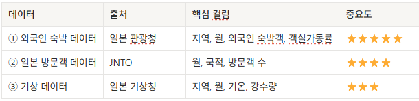
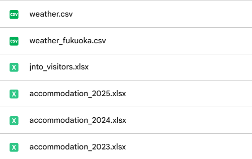
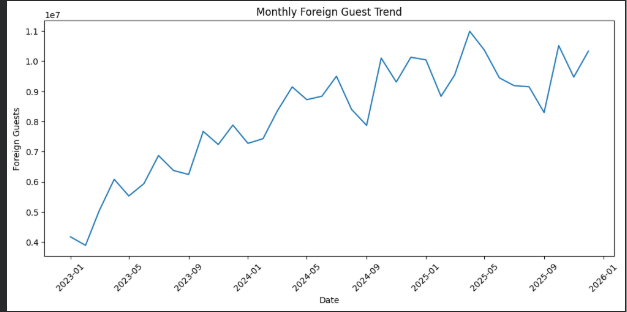
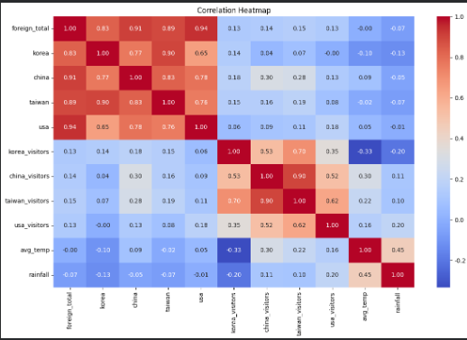
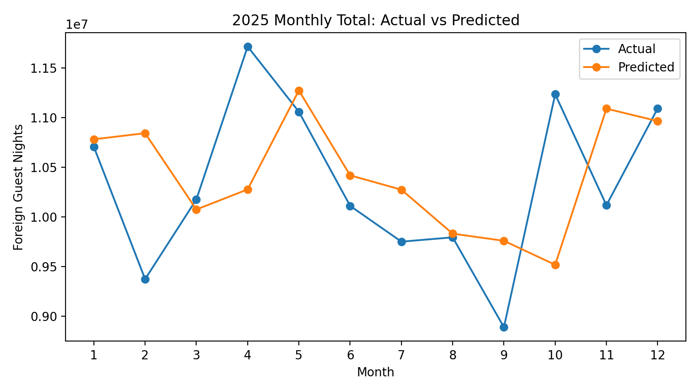
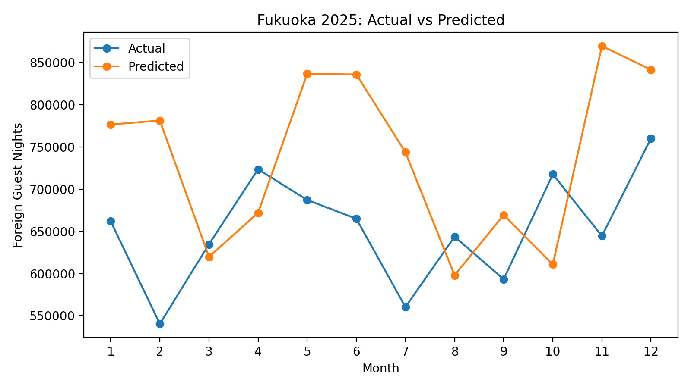
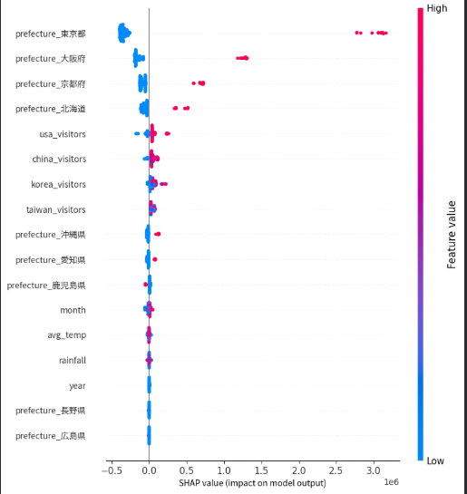
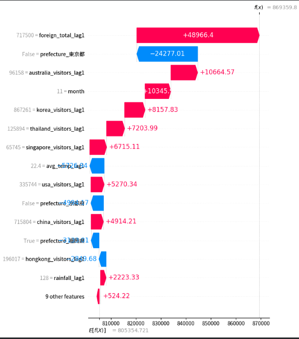
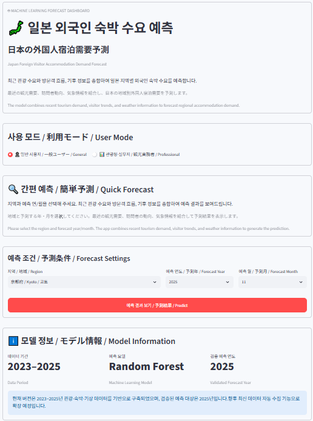

# 🗾 일본 외국인 숙박 수요 예측
### Japan Inbound Accommodation Demand Forecast

> 2023–2025년 일본의 **숙박 통계 · 국가별 방일객 수 · 기상 데이터**를 결합하여  
> 지역별 외국인 숙박 수요를 예측하고, SHAP으로 예측 근거를 설명한 머신러닝 프로젝트입니다.

[🚀 Live Demo - Streamlit][https://japan-inbound-demand-forecast-kgfvnn4sva2oubuwwhzooq.streamlit.app/)]  
[📑 Portfolio PPT](docs/japan_inbound_portfolio.pptx)

---

## 1. 프로젝트 개요

### 목표
- 일본 지역별 **월간 외국인 숙박 수요 예측**
- 단순 예측값뿐 아니라 **SHAP을 이용한 영향요인 설명**
- 일반 사용자와 관광 실무자가 모두 사용할 수 있는 **Streamlit 예측 서비스 구현**

### 핵심 구성

| 항목 | 내용 |
|---|---|
| 데이터 기간 | 2023–2025 |
| 모델 | Random Forest Regressor |
| 특징 설계 | 전월 데이터 기반 Lag 1 |
| 학습 | 2023–2024 |
| 테스트 | 2025 |
| 설명 가능성 | Global SHAP / Local SHAP |
| 서비스 | Streamlit |

---

## 2. 데이터 구성

일본의 공식 통계 데이터를 월·지역 단위로 결합했습니다.

| 데이터 | 출처 | 주요 내용 |
|---|---|---|
| 외국인 숙박 통계 | Japan Tourism Agency | 지역, 월, 외국인 연숙박자 수 |
| 방일객 통계 | JNTO | 한국, 중국, 대만, 미국, 홍콩, 태국, 싱가포르, 호주 |
| 기상 데이터 | JMA | 평균기온, 강수량 |

숙박 데이터 기준:

**2023–2025 × 12개월 × 47개 도도부현 = 1,692행**



### 실제 사용 파일



### 전처리 과정에서 해결한 이슈
- 숙박통계의 호주 표기 `オーストラリア`와 JNTO의 `豪州`를 `australia`로 통일
- 기존 기상 데이터에 없던 후쿠오카 자료를 JMA에서 추가 수집
- 숫자 컬럼의 쉼표·`*` 제거 후 numeric 변환
- 지역 코드 제거 및 `prefecture` 이름 정규화
- `year + month + prefecture` 기준으로 데이터 통합

---

## 3. EDA

### 3-1. 외국인 숙박 수요 흐름



2023년 이후 외국인 숙박 수요는 전반적으로 증가했으며,  
월별 증감이 반복되어 **계절적 변동**이 존재함을 확인했습니다.

따라서 모델에는 단순 추세뿐 아니라 **월 정보, 국가별 방문객 흐름, 기상 정보**를 함께 사용했습니다.

### 3-2. 변수 상관관계



지역별 국적 숙박객 수는 전체 외국인 숙박객 수(`foreign_total`)와 매우 높은 상관관계를 보였습니다.

하지만 이 값들은 `foreign_total`을 구성하는 값이므로 모델 입력에 그대로 사용할 경우  
**Target Leakage(타깃 누수)**가 발생할 수 있습니다.

> **Target Leakage**  
> 예측 시점에 알 수 없는 정답 정보가 입력 변수에 섞여 모델이 실제보다 과도하게 잘 맞는 현상

따라서 지역별 국적 숙박값은 **EDA에는 사용하되 최종 예측 변수에서는 제외**했습니다.

---

## 4. Feature Engineering

실제 **다음 달 예측** 구조를 만들기 위해 전월 값을 Lag 1 특징으로 사용했습니다.

### 최종 입력 특징
- 전월 지역 전체 외국인 숙박 수요
- 전월 JNTO 8개국 방문객 수
- 전월 평균기온
- 전월 강수량
- 예측 연도
- 예측 월
- 지역

즉,

```text
전월 데이터
    ↓
Lag 1 Feature
    ↓
다음 달 숙박 수요 예측
```

---

## 5. 모델링

### Random Forest

여러 개의 의사결정나무의 예측을 종합해 최종 값을 계산하는 앙상블 모델입니다.

```python
RandomForestRegressor(
    n_estimators=300,
    random_state=42,
    n_jobs=-1
)
```

### 시간 순서 기반 검증

Random Split 대신 미래 시점을 통째로 분리했습니다.

```text
Train : 2023–2024
Test  : 2025
```

이를 통해 실제 운영 상황과 비슷한 조건에서 모델을 평가했습니다.

---

## 6. 모델 성능

2025년 테스트 데이터 기준 결과입니다.

| Metric | Result | 의미 |
|---|---:|---|
| MAE | **126,818** | 실제값과 예측값의 평균 절대 차이 |
| RMSE | **197,845** | 큰 오차에 더 민감한 평가 지표 |
| R² | **0.974** | 실제 숙박 수요 변동의 약 97.4% 설명 |

### 해석
- 전체적인 지역·월별 수요 구조는 높은 수준으로 설명
- MAE보다 RMSE가 크게 나타나 **일부 지역·월에 큰 오차가 존재**
- 평균 성능지표뿐 아니라 실제값과 예측값의 월별 비교도 함께 확인

---

## 7. 2025 실제값 vs 예측값

10개 모델링 지역의 월별 총합 기준입니다.



전체적인 수요 규모와 방향성은 비교적 잘 따라가지만  
일부 급격한 변동 구간에서는 과대 또는 과소예측이 발생했습니다.

---

## 8. 대표 사례: 후쿠오카 2025



후쿠오카는 월별 추세를 일부 따라갔지만 특정 월에서 비교적 큰 오차가 나타났습니다.

| 월 | 실제값 | 예측값 | 오차율 |
|---:|---:|---:|---:|
| 1 | 661,840 | 776,510 | 17.3% |
| 2 | 540,410 | 781,182 | 44.6% |
| 3 | 634,680 | 619,763 | 2.4% |
| 4 | 723,450 | 671,941 | 7.1% |
| 5 | 687,180 | 836,580 | 21.7% |
| 6 | 664,930 | 835,777 | 25.7% |
| 7 | 560,300 | 743,540 | 32.7% |
| 8 | 643,620 | 597,958 | 7.1% |
| 9 | 593,280 | 669,356 | 12.8% |
| 10 | 717,500 | 610,762 | 14.9% |
| 11 | 644,420 | 869,360 | 34.9% |
| 12 | 760,200 | 841,347 | 10.7% |

특히 **2월, 7월, 11월**에서 오차가 크게 나타났습니다.

이 결과를 통해 모델의 전체 설명력은 높지만  
특정 월의 급격한 변동성까지 완벽하게 예측하지는 못한다는 한계를 확인했습니다.

---

## 9. SHAP 분석

### 9-1. Global SHAP



Global SHAP을 통해 전체 모델에서 어떤 특징들이 예측값에 큰 영향을 미치는지 확인했습니다.

주요 영향요인:
- 지역 특성
- 국가별 JNTO 방문객 흐름
- 월 정보
- 기상 정보

즉, 모델은 단순 상관관계만 사용하는 것이 아니라  
**지역과 시점에 따른 비선형적인 조합**을 학습했습니다.

### 9-2. Local SHAP — 후쿠오카 2025년 11월



예측값: **약 869,360**

기준값: **약 805,535**

주요 양(+)의 영향:
- 전월 숙박 수요: **+48,966**
- 호주 방문객 Lag: **+10,665**
- 11월 효과: **+10,345**
- 한국 방문객 Lag: **+8,158**

주요 음(-)의 영향:
- 도쿄 지역이 아님: **약 -24,277**

이를 통해 모델이 단순히 예측값만 제시하는 것이 아니라  
**왜 해당 예측값이 나왔는지 설명할 수 있도록 구성**했습니다.

---

## 10. Streamlit 예측 서비스



사용자 역할에 따라 두 가지 모드를 구현했습니다.

### General Mode
일반 사용자가 복잡한 통계값을 직접 입력하지 않아도 사용할 수 있도록 구성했습니다.

- 지역 선택
- 예측 연도: 2025
- 예측 월 선택
- 필요한 기준 데이터 자동 조회
- 지역명을 일본어 / 영어 / 한국어로 병기

사용자 안내 문구:

> 최근 관광 수요와 방문객 흐름, 기후 정보를 종합하여 예측 결과를 보여드립니다.

### Professional Mode
관광청 또는 관광 실무자가 보유한 최신 값을 직접 입력할 수 있습니다.

- 최근 외국인 숙박 수요
- JNTO 8개국 방문객 수
- 평균기온
- 강수량

이를 통해 **편의성과 실무 활용성을 동시에 고려한 UI**를 설계했습니다.

---

## 11. 개발 과정

```text
데이터 수집
    ↓
전처리 / 통합
    ↓
EDA
    ↓
Target Leakage 발견
    ↓
Lag Feature 설계
    ↓
Random Forest
    ↓
2025 Temporal Holdout
    ↓
SHAP
    ↓
Gradio Prototype
    ↓
Streamlit App
```

초기에는 Gradio로 모델과 UI의 연결을 빠르게 검증했고,  
이후 포트폴리오와 사용자 경험을 고려해 **Streamlit 기반 앱으로 전환**했습니다.

---

## 12. 현재 한계

- 학습 기간이 2023–2024로 비교적 짧음
- 독립 테스트로 검증된 미래 구간은 현재 **2025년**
- 기상 데이터는 선택 지역의 데이터 커버리지에 의존
- Random Forest는 학습 범위를 넘어선 미래 연도 외삽에 적합하지 않음

따라서 현재 Streamlit 앱에서는  
**예측 연도를 2025년으로 제한**했습니다.

이는 검증되지 않은 미래 연도를 예측 가능한 것처럼 보이게 하지 않기 위한 설계입니다.

---

## 13. 향후 개선

1. 2025년 실측 데이터를 학습 데이터에 추가
2. 모델 재학습 및 2026년 예측 검증
3. JNTO / JMA / 숙박 통계 자동 수집 파이프라인 구축
4. 최신 Lag 데이터 자동 생성
5. Streamlit 서비스 운영 고도화

---

## 14. Tech Stack

- Python
- pandas
- NumPy
- scikit-learn
- SHAP
- matplotlib
- Streamlit
- Google Colab
- Git / GitHub

---

## 15. Repository Structure

```text
japan-inbound-demand-forecast/
├─ app.py
├─ requirements.txt
├─ README.md
├─ japan_inbound_final_v2.csv
├─ random_forest_lag_final.pkl
├─ model_columns_final.pkl
├─ docs/
│  └─ japan_inbound_portfolio.pptx
└─ assets/
   ├─ data_summary_table.png
   ├─ source_files.png
   ├─ monthly_foreign_guest_trend.png
   ├─ correlation_heatmap.png
   ├─ actual_vs_predicted_2025.png
   ├─ fukuoka_actual_vs_predicted_2025.png
   ├─ shap_global_summary.png
   ├─ shap_fukuoka_2025_11.png
   └─ streamlit_app.png
```

---

## Key Takeaway

이 프로젝트는 단순히 머신러닝 모델의 정확도를 높이는 데 그치지 않고,

**공식 데이터 수집 → 전처리 → EDA → Leakage 점검 → 시계열 검증 → SHAP 설명 → Streamlit 서비스 구현**

까지 하나의 프로젝트 흐름으로 연결했습니다.
